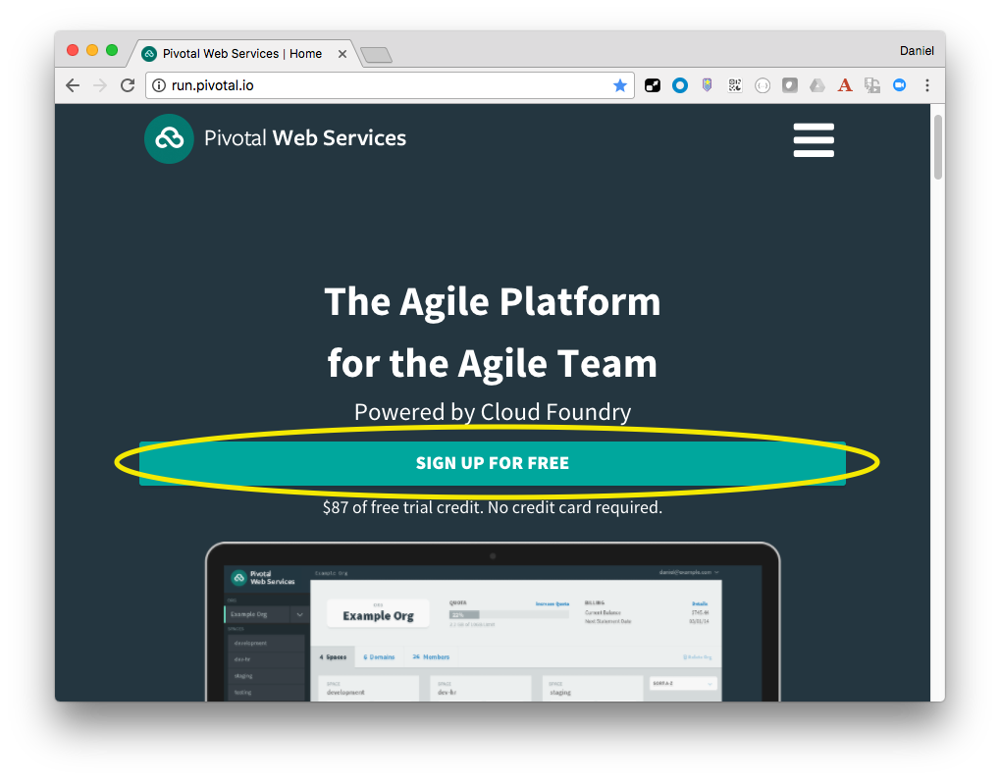
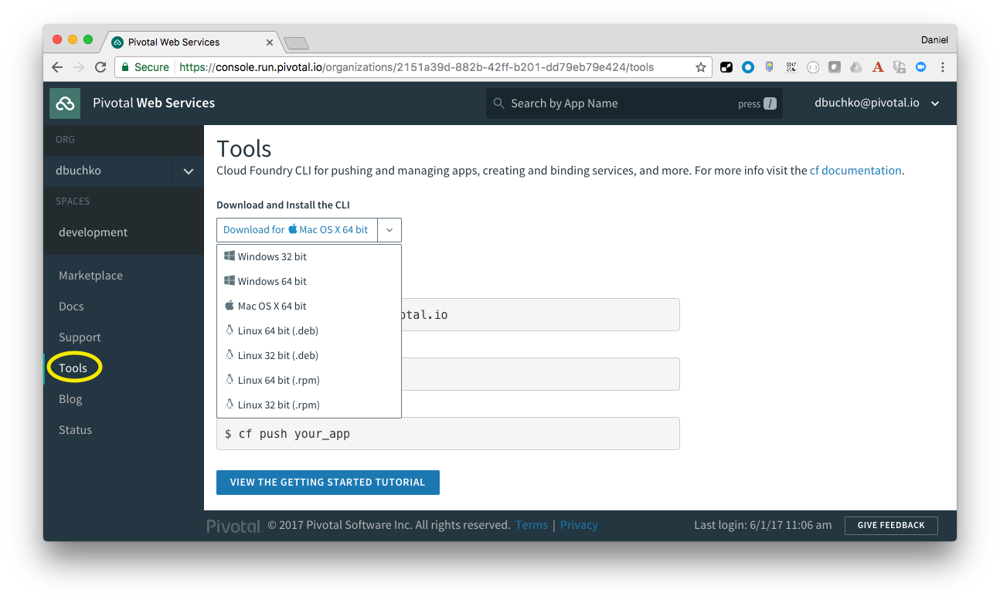

#Pivotal CF Workshop - Lab Instructions

##Module 1

###Goals
* Create a Pivotal CF account.
* Install the CF CLI
* Lab VM Setup (optional)

###Steps
1. Go to [Pivotal Web Services (PWS)](http://run.pivotal.io) and follow the instructions to sign up for a free account.

	

2. An organization is a logical grouping for your applications.  Since PWS is a publicly hosted version of PCF, you must pick an organization name that is unique across all accounts.  Your email address would be a good choice.

3. Your Account should now be setup, be certain to log in.

4. Navigate to the `Tools` sub-menu on the left panel, and use the dropdown to select and download the CF CLI for your OS.

	

5. Install the CLI.

6. Explore the CF CLI commands:

	```
cf help -a
```

7. OPTIONAL: If it is not possible to install the CF CLI locally, or you cannot access the Github repository, then logon to the Amazon AMI instance assigned to you.
