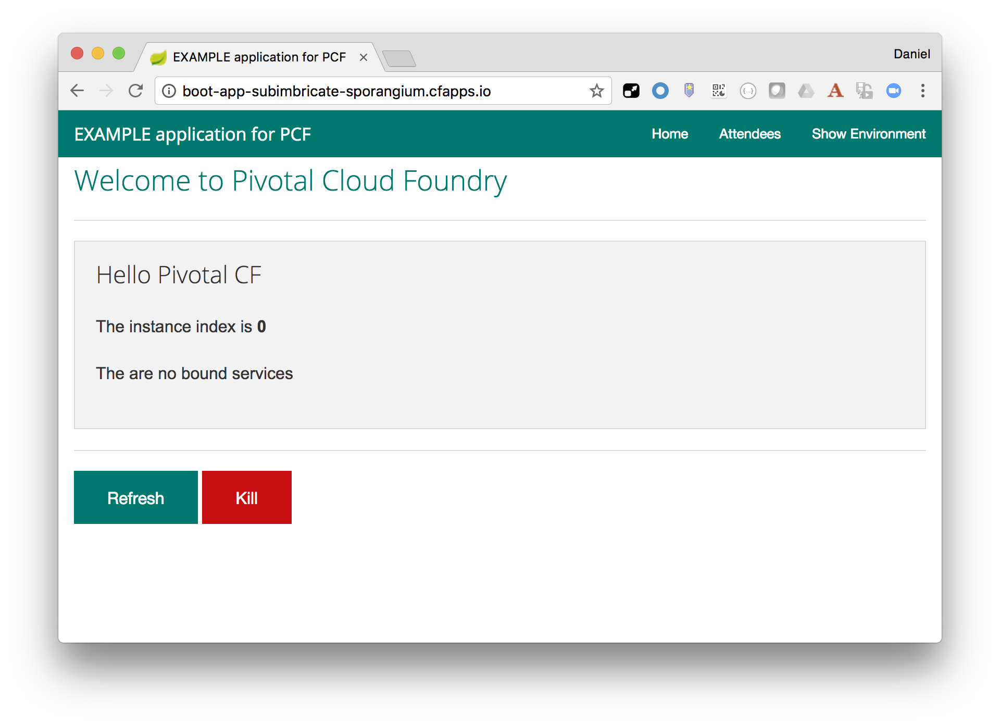
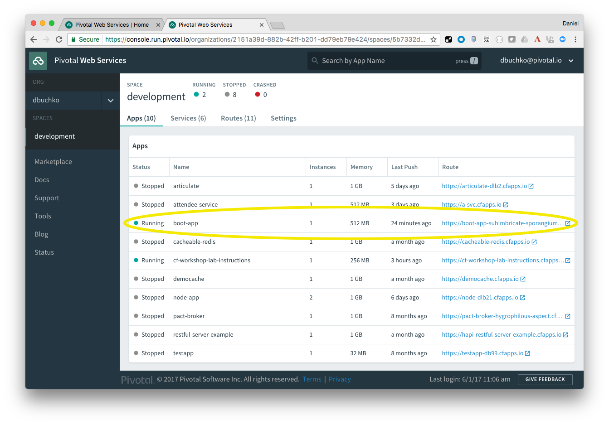

#Pivotal CF Workshop - Lab Instructions

##Java Module 2A

###Goals
* Get Sample Application Source Code
* Build Sample Application
* Target Cloud Foundry instance
* Login to through CLI
* Push application using CLI prompts
* Access deployed application
* View application in PWS (Apps Manager)

###Steps
1. From command prompt clone the workshop sample application from [https://github.com/dbuchko/cf-workshop-spring-boot](https://github.com/dbuchko/cf-workshop-spring-boot)
```
> git clone https://github.com/dbuchko/cf-workshop-spring-boot.git
```

2. In a terminal window (or command prompt), switch to the cf-workshop-spring-boot directory and build the application using Apache Maven.

	```
> mvn clean package
```

	Look in the `target` directory, verify the `cf-workshop-spring-boot-0.0.4-SNAPSHOT.jar` has been created successfully.

3. Using the CF CLI login to using the user name and password for your cloud foundry account, targeting the public Pivotl CF instance (Pivotal Web Services - PWS)

	```
  > cf login -a api.run.pivotal.io
  ```

	Follow prompts to supply user name and password

4. Execute the CLI target command  to see the details of the org and space you are logged into

	```
  > cf target
  ```

5. From the _project root directoy_, use the CF CLI to deploy the application using `cf push` command:

	```
  > cf push
  ```

	Observe the output and note some of the activities that are being shown.  Take particular note of the `urls` that are displayed just before the command completes, it will look similar (but not identical) to the following:

	```
urls: boot-app-subimbricate-sporangium.cfapps.io
```

6. Open a browser and navigate to the application by entering _your_ URL output from the previous step.

	

7. On another tab in your browser, navigate to your space in PWS (Apps Manager) and explore your application.  Take a bit of time to look around.

	
