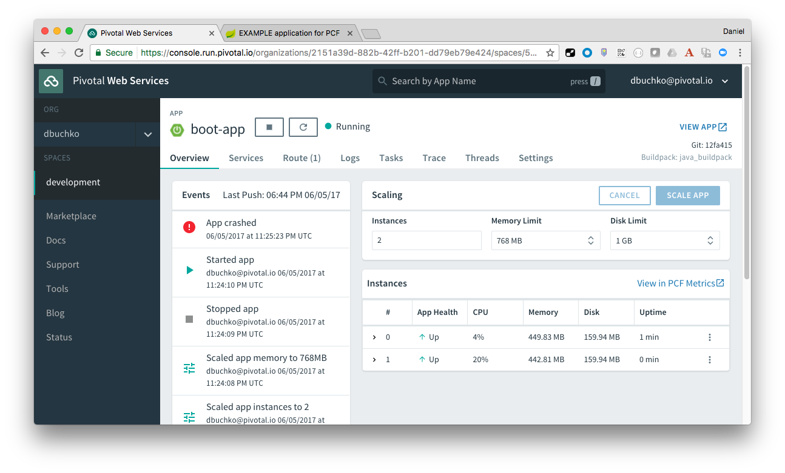

#Pivotal CF Workshop - Lab Instructions

##Java Module 3A

###Goals
* Scale deployed application to multiple instances
* Verify application scaling occurred
* Access logs for your application

###Steps
1. Get information about your deployed app using CLI command

	```
	> cf app <<app-name>>
	```

	Note the number of instances, which should be `1/1`.  That means 1 instance is running out of a desired total of 1 instances.

2. Scale the application to 2 instances

	```
	> cf scale <<app-name>> -i 2
	```

3. Verify that there are now 2 instances

	```
	> cf app <<app_name>>
	```

	(Some of the instances may be starting, repeat checking instances until all start)

4. Navigate to the Environment page of the app in the browser, and refresh it several times.  You should see the various application parameters changing as the HTTP request gets delivered to each instance of the app running in PCF.

	

5. Click the `kill` button, and then click the `back` button of your browser to navigate back to the environment page.  Refresh the page several times.  You will notice that the application still responds to requests, and that soon all instances of the app are responding again.

6. View the app in the PWS Apps Manager, and verify the number of instances are back to 2.

	

7. In your terminal window (or command prompt), tail the logs of your application:

	```
cf logs <<app-name>>
```

8. Open a second terminal window or command prompt, and scale the application back down to 1 instance, then observe the logs in the first window.

	```
	> cf scale <<app-name>> -i 1
	```

	Refresh the application in your browser a couple times to see requests being logged.

9. Finally, in the window running the `cf logs` command, press `<ctrl>-c` to terminate the command.  To obtain recent logs using the CLI, run

	```
cf logs <<app-name>> --recent
```

10. Explore the same application logs in the PWS Apps Manager web interface.
