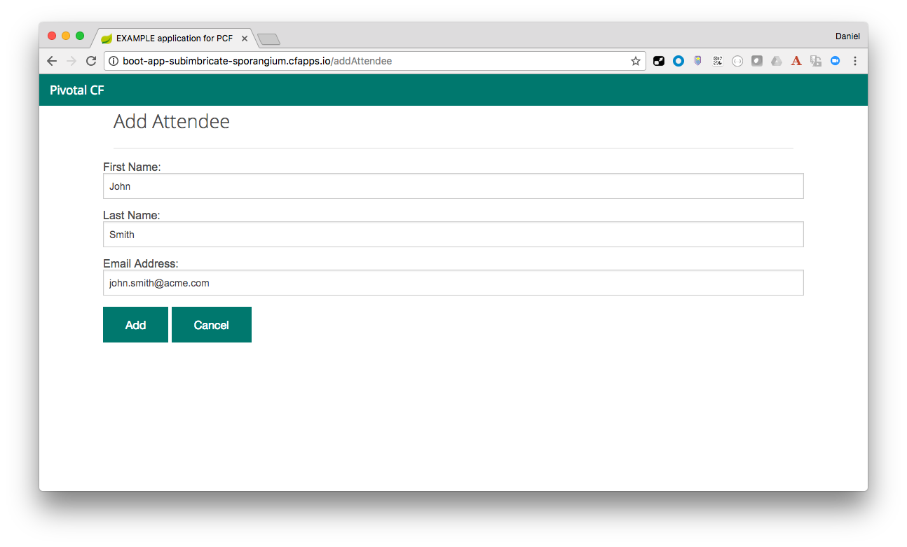
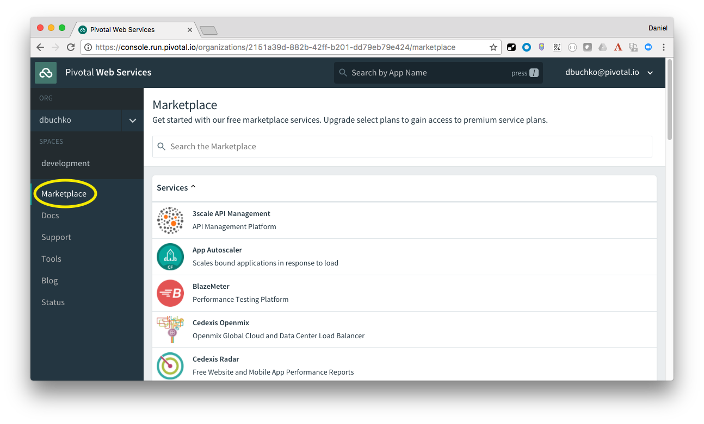

#Pivotal CF Workshop - Lab Instructions

##Java Module 4A

###Goals
* Create service
* Bind service
* Start application and use service

###Steps
1. From the application running in your browser, click the `Attendees` link and add an attendee to your application.

	

	Confirm that you see the new record added in your app.

2. Restart your application.

	```
cf restart <<app-name>>
```

	Verify the attendee you just added doesn't exist anymore by navigating to the `Attendees` link of the application.

3. Let's add a database service to preserve the list of attendees when our app restarts.

	Browse the list of services available in the Marketplace using the PWS Apps Manager.

	

	Perform the same task from the CF CLI.  Try to see if you can find a MySQL service in the list.

	```
cf marketplace
```

4. Use the CF CLI to create a new database service.

	```
	> cf create-service cleardb spark sql-svc
	```

5. Verify the service was created

	```
	> cf services
	```

	You should see the service you just created listed.  It should not be bound to any applications.

6. Bind the service to your deployed application

	```
	> cf bind-service <<app_name>> sql-svc
	```


7. Verify the service has been bound to your application.

	```
	> cf services
	```

	You should now see the service created earlier listed in the `bound apps` column.

8. Restart the application to utilize the service.

	```
	> cf restart <<app_name>>
	```

9. After the application restarts, repeat steps 2&3 to verify the attendees are retained even if the application is restarted.
