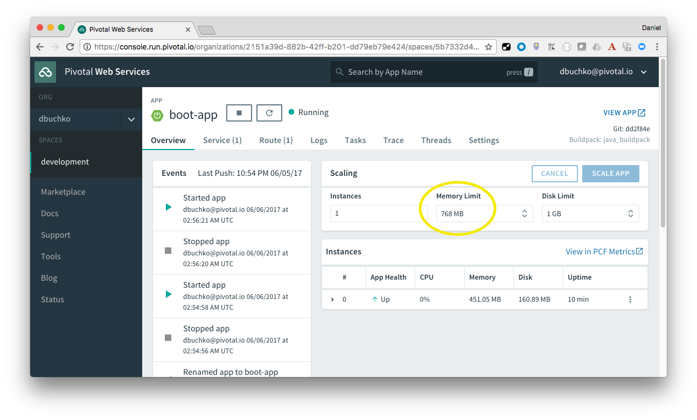

#Pivotal CF Workshop - Lab Instructions

##Java Module 5A

###Goals
* Deploy using a manifest

###Steps
1. Let's demonstrate how we can use a manifest file for consistent application deployments.  First, using the `cf app <<app-name>>` command from CF CLI, or the PWS Apps Manager, confirm that your application has been allocated 768M of memory.

	

2. In the project root directory, edit the `manifest.yml` file.

3. Change the memory from `768M` to `1G`, and save the file.

4. From the project root directory, push the application again, and use the Apps Manager or CF CLI to observe the updated memory allocated to the application.
